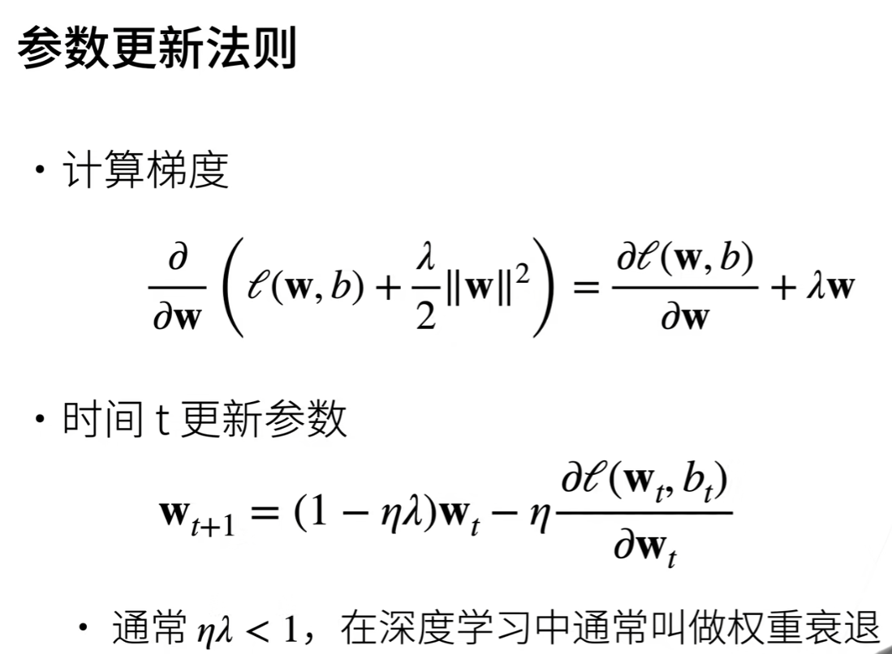

## 将一些笔记整理在这里 随时回来看

##### 权重衰减：


限制参数的变化范围来控制模型容量。



吐槽一下：这里主要是讲的权重衰减原理，但其实现在大部分包（torch）都已经给出了一个非常好用的接口。

如下，只需要在构建优化器时，将w作为参数输入即可。

```python
trainer = torch.optim.SGD([
        {"params":net[0].weight,'weight_decay': wd},
        {"params":net[0].bias}], lr=lr)
```


##### 数据增广：

通过变形数据来获取多样性，从而使模型的泛化性能更好。

常见的图片增广包括翻转、切割、变色等等。

做完Kaggle之后的一些想法：学了这些模型最大的感觉就是这种“站在巨人肩膀的感觉”，很多必须要实现的一些功能光是想想就很麻烦，但是只要合适的外部库直接调用就行了，几行代码就能写出一个完整的模型。
又想到老师提到的不要太过于专注底层，也许太过钻牛角尖也是一种舒适区吧。

##### 注意力分数


------

第一遍的学习结束了，温故而知新，多重新看看。
